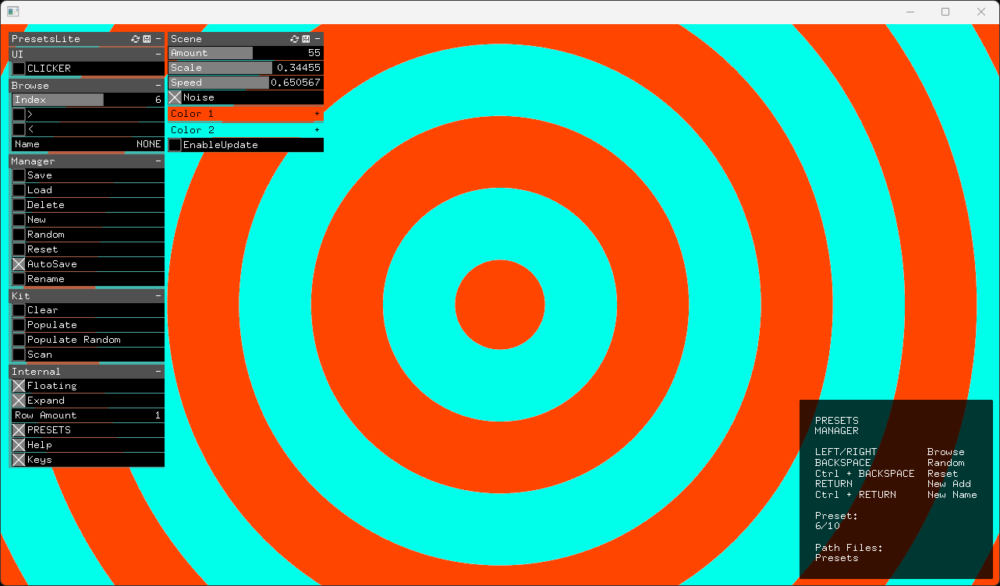
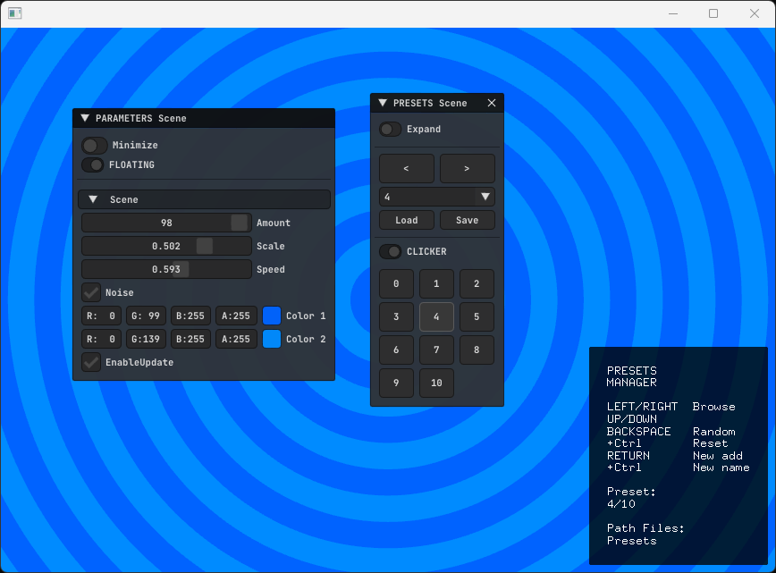

## Overview

A simple class to handle an `ofParameterGroup` presets with some helpers to randomize and `Kit organization`.  

This class is based on and separated from [ofxSurfingHelpers](https://github.com/moebiussurfing/ofxSurfingHelpers) / [Example](https://github.com/moebiussurfing/ofxSurfingHelpers/tree/master/Examples/PresetsLite).  

## Features
- Use your preferred UI lib: `ofxGui` or `ImGui` (**ofxSurfingImGui**).
- Auto-created **UI controls** for added `ofParameterGroup` params content.
- Auto-populate a **Kit** of presets if no files are found. (App is opening for the first time).
- Manager:
  - Simple **randomizer** and **reset** preset.
  - **Populate** a Kit of **copies** from selected preset or new randomizations.
- **Persistent** settings as **index** selected, matrix sizes (**ImGui**), and settings.
- **Copy** and **Swap** presets on the **matrix clicker**. (**ImGui**)

## Screenshots
### 1_Example_Presets_ofxGui

### 2_Example_Presets_ImGui

## Required
- [ofxSurfingHelpersLite](https://github.com/moebiussurfing/ofxSurfingHelpersLite)
#### For Example 1
- **ofxGui** / **OF core**
#### For Example 2
- [ofxSurfingImGui](https://github.com/moebiussurfing/ofxSurfingImGui/tree/develop)

### TODO
- Add multiple independent groups.
- Add randomizer for nested groups.
  - Improved randomizer: center value and power.
- Add multiple Kits management.

## TESTED SYSTEMS
* **Windows 11** / **VS 2022** / **OF 0.12+** @[GitHub master branch](https://github.com/openframeworks/openFrameworks)
* Should work probably also on `macOs` and `Linux`.

## LICENSE
**MIT License**
